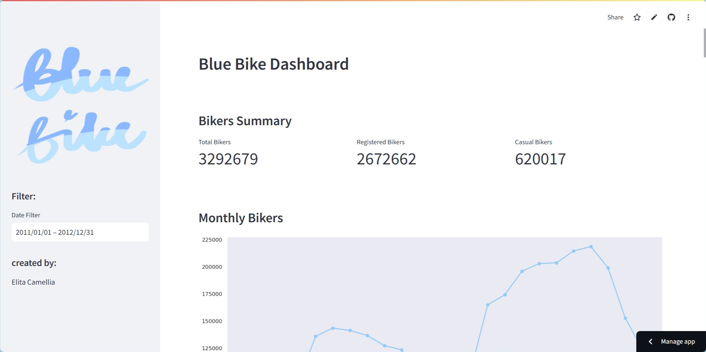
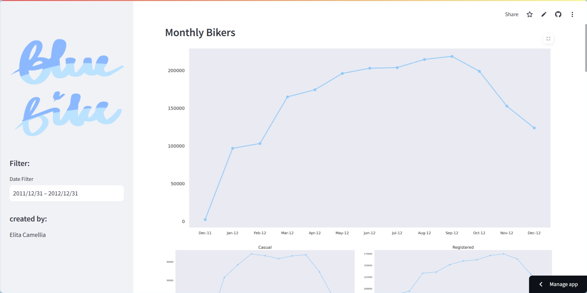
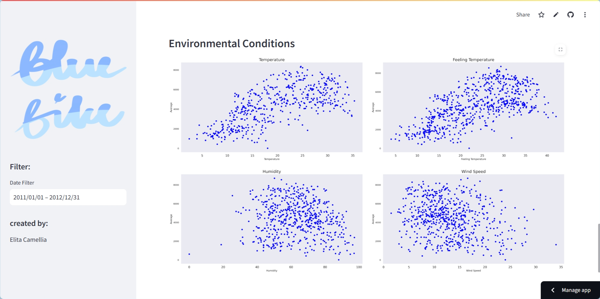

# Blue Bike Sharing Data Analysis
This project is part of the final submission for the "Belajar Data Analysis dengan Python" course and focuses on analyzing a bike sharing dataset obtained from Kaggle.

Throughout the project, I applied key data analysis concepts, including data analysis fundamentals, descriptive statistics, data preprocessing, data wrangling, exploratory data analysis (EDA), data visualization, and dashboard development.

The primary goal of this project was to uncover meaningful insights from the dataset and effectively communicate those findings in a clear and informative manner.

Visit the Dashboard:
https://bluebikedashboard.streamlit.app/

## Languages and Libraries
- Python Notebook
- Python
- Streamlit
- Pandas
- Matplotlib
- Seaborn

## Dataset
This project uses the [Bike Sharing Dataset](https://www.kaggle.com/datasets/lakshmi25npathi/bike-sharing-dataset) from Kaggle. The dataset contains hourly and daily counts of rental bikes from 2011 to 2012, collected from the Capital Bikeshare system, along with corresponding weather and seasonal information. For this project, only the **daily** data is used.

## Business Statements and the Insights
### 1. How does the number of casual and registered users differ across the seasons?
> 
> Bike rentals by registered users are significantly higher than those by casual users across all seasons. The highest total number of rentals for both user types occurs during the fall, followed by summer and winter. Spring records the lowest number of rentals, especially among casual users.

### 2. How do weather conditions affect the number of bike rentals?
>
>Bike rentals, by both casual and registered users, increase during clear weather, followed by misty conditions, and tend to decrease during light rain or snow. This pattern indicates that favorable weather conditions encourage biking activity, while poor weather conditions reduce users' interest in renting and using bikes.

### 3. Is there a difference in the number of bike rentals between weekdays and holidays over the past two years?
>
>The difference in the number of bike rentals between weekdays and holidays, including weekends and public holidays, shows a noticeable gap. Interestingly, the number of rentals by casual users remains relatively consistent between weekdays and holidays. This suggests that casual users tend to use bikes for leisure activities that are not tied to a fixed work schedule. In contrast, registered users show significantly higher rental activity on weekdays compared to holidays, indicating that most registered users likely rely on bikes as a primary mode of transportation for commuting purposes.

### 4. What is the relationship between actual temperature and perceived temperature in relation to the number of bike rentals?
>
> There is a positive correlation between actual temperature (temp) and perceived temperature (atemp) with the number of bike rentals. 

**Correlation Between `atemp` and `count`**

|       | atemp  | count  |
|-------|--------|--------|
| atemp | 1.000  | 0.631  |
| count | 0.631  | 1.000  |

**Correlation Between `temp` and `count`**

|       | temp   | count  |
|-------|--------|--------|
| temp  | 1.000  | 0.627  |
| count | 0.627  | 1.000  |

>The data shows that bike rental counts increase as the temperature rises. Specifically, the correlation between perceived temperature (atemp) and rental count is 0.631, while the correlation between actual temperature (temp) and rental count is 0.627. These values indicate that both temperatures are moderately positively correlated with bike usage, with atemp having a slightly stronger relationship. This suggests that how comfortable users feel with the temperature may influence their decision to rent bikes more than the actual measured temperature. However, it’s also possible that extremely high temperatures could discourage biking due to discomfort.

## 5. How do humidity and wind speed impact the number of bike rentals?

**Relationship between Humidity and Bike Rentals**
>

|          | Humidity | Count    |
|----------|----------|----------|
| Humidity | 1.000    | -0.1007  |
| Count    | -0.1007  | 1.000    |

**Relationship between Wind Speed and Bike Rentals**
>

|          | Windspeed| Count    |
|----------|----------|----------|
| Windspeed| 1.000    | -0.2345  |
| Count    | -0.2345  | 1.000    |

>Based on the visualization and correlation values, both humidity and wind speed show a weak negative relationship with the number of bike rentals. The correlation between humidity and bike rental count is -0.1007, while the correlation between wind speed and rental count is -0.2345. These values indicate a very weak negative correlation, suggesting that changes in humidity and wind speed have minimal impact on bike rental activity. The scattered pattern seen in the visualizations further supports this, showing that neither humidity nor wind speed is a key factor influencing bike rental behavior.

## Conclusion
- The pattern of bike rentals by all users is influenced not by a single factor, but by various interrelated factors such as season, weather conditions, commuting needs, and environmental factors like humidity and wind speed.
- There is a significant difference between the number of rentals made by registered users and casual users, with the majority of bike rentals being dominated by registered users.
- The most notable distinction between registered and casual users lies in their rental patterns:
    - Registered users tend to rent bikes more frequently on weekdays, with a noticeable decline during weekends.
    - Casual users are more likely to rent bikes on weekends than on weekdays.

## Dashboard Previews

