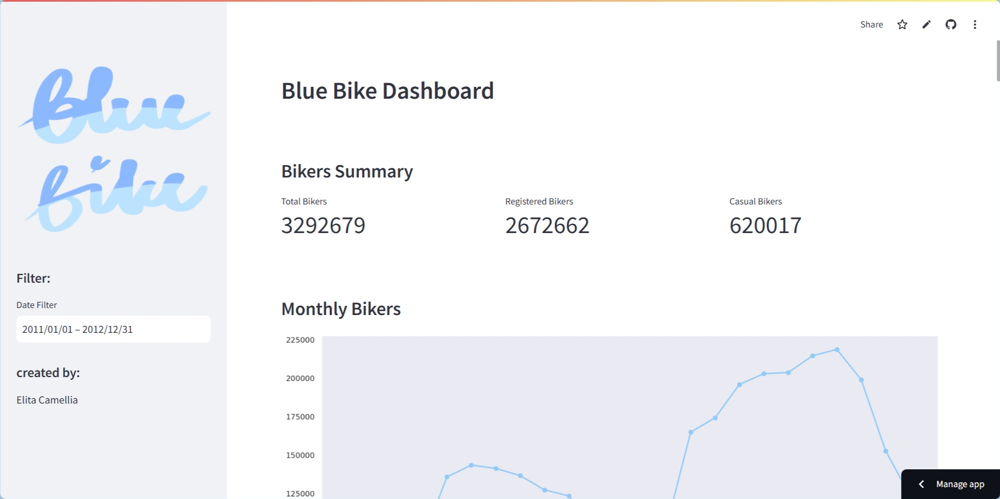
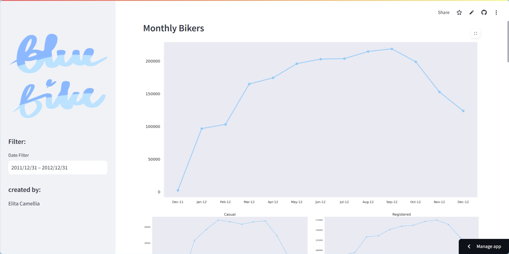
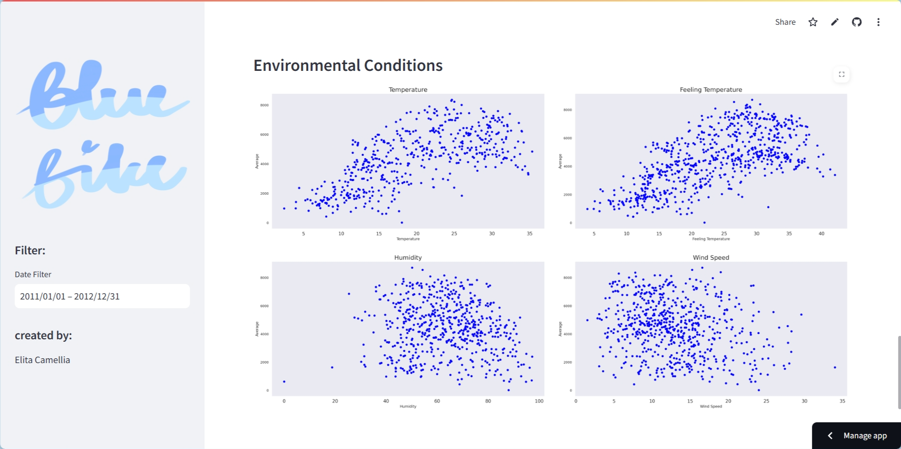

# Blue Bike Sharing Data Analysis

## Installation
1. Clone this repository to your local machine:
```
git clone https://github.com/camelliatea/dicoding-proyek-analisis-data.git
```
2. Install the required Python packages
```
pip install -r requirements.txt
```
3. Go to the project directory
```
cd dicoding-proyek-analisis-data
/dashboard/
```
4. Run the project
```
streamlit run dashboard.py
```
or visit the following links
https://bluebikedashboard.streamlit.app/

## Dashboard Previews




